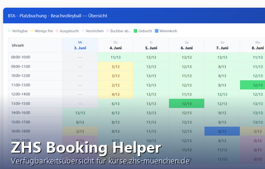

# ZHS Booking Browser Extension

A browser extension for [kurse.zhs-muenchen.de](https://kurse.zhs-muenchen.de) that replaces the site's one-day-at-a-time view with a full 7-day grid of all sports courts and time slots. Book directly from the grid with a single click.



## Features

- 7-day availability overview for all ZHS sports (beach volleyball, tennis, and more)
- 1-hour and 2-hour booking modes
- Your booked slots and cart items are highlighted in the grid
- Language follows the website (German on `/de/`, English on `/en/`)
- Works on desktop and Firefox for Android

## Browser support

| Browser | Store |
|---------|-------|
| Firefox 140+ | [Firefox Add-ons (AMO)](https://addons.mozilla.org) |
| Firefox for Android 142+ | Firefox Add-ons (AMO) |
| Chrome / Chromium 88+ | [Chrome Web Store](https://chrome.google.com/webstore) |

## Project structure

```
extension/          Browser extension source (load unpacked or zip to publish)
  manifest.json
  content.js
  styles.css
  icon.svg
  _locales/
    de/messages.json
    en/messages.json
images/             Screenshots for store listings
STORE_SUBMISSION.md Store submission checklists and best practices
```

## Development

Load unpacked in Firefox:
1. Go to `about:debugging` → "This Firefox" → "Load Temporary Add-on"
2. Select `extension/manifest.json`

Load unpacked in Chrome:
1. Go to `chrome://extensions` → enable Developer mode
2. Click "Load unpacked" → select the `extension/` folder

## Adding a new language

1. Create `extension/_locales/{lang}/messages.json` — copy `de/messages.json` as a template.
2. Translate all 34 string keys.
3. Add `"_locales/{lang}/messages.json"` to the `web_accessible_resources[0].resources` array in `manifest.json`.
4. The extension automatically uses the new locale when the website URL contains that language segment (e.g. `/fr/`).

## Privacy

The extension does not collect, transmit, or store any personal data. It communicates only with `kurse.zhs-muenchen.de` using the session cookie already present in the browser, identical to what the site itself does.
